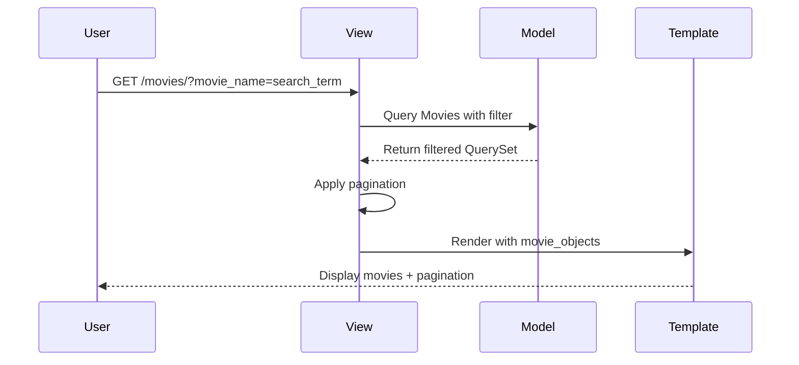
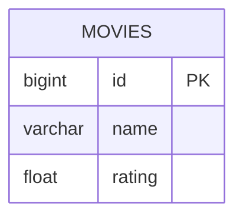

# Django Movie List

#### Current status: Complete

___

### Personal Progress
* **What I learned**: How to implement search functionality in Django views using QuerySet filtering and GET parameters, along with pagination for better user experience
* **What I wish I had done differently**: Used a larger dataset with more realistic movie data to better test the search and pagination features
* **What I am most proud of**: Being able to implement most of the project without the help of the course videos since I had learned the concepts in previous lessons or had learned them on my own
* **What I want to learn next**: Start on full, production quality products in the course

## Description
This is a simple movie listing application built as a mini-project in the [Python and Django Framework Complete Course](https://www.udemy.com/course/django-course/) to practice Django fundamentals including models, views, templates, search functionality, and pagination. The application allows users to browse movies, search by movie name, and navigate through paginated results. The project demonstrates core Django concepts including the MTV (Model-Template-View) pattern, QuerySet filtering, and Django's built-in pagination.

## Features
This describes the key capabilities implemented in the application:

- **Movie Listing**: Display all movies in the database
- **Search Functionality**: Filter movies by name using case-insensitive search
- **Pagination**: Navigate through movie results with 2 items per page
- **Simple UI**: Basic HTML template with search form and pagination controls

## How It Works
The request-response flow shows how Django processes requests:



The database schema illustrates the movie data structure:



## Application Structure

### Django Apps
The project consists of one main Django app:

**newapp**: Manages all movie-related functionality
- Models: `Movies` (movie records with name and rating)
- Views: `movie_list` (displays movies with search and pagination)
- Templates: `movie_list.html` (renders movie list with search form)

### View Implementation
The project uses a function-based view with search and pagination (`newapp/views.py:6-17`):

```python
def movie_list(request):
    movie_objects = Movies.objects.all()

    movie_name = request.GET.get('movie_name')

    if movie_name is not None and movie_name != '':
        movie_objects = movie_objects.filter(name__icontains=movie_name)

    paginator = Paginator(movie_objects, 2)
    page_number = request.GET.get('page')
    movie_objects = paginator.get_page(page_number)
    return render(request, 'newapp/movie_list.html', {'movie_objects': movie_objects})
```

**Key Features:**
- GET parameter handling for search queries
- Case-insensitive name filtering using `icontains`
- Django Paginator with 2 items per page
- Page number from GET parameters

### Model Definition
The Movies model is simple and straightforward (`newapp/models.py:4-11`):

```python
class Movies(models.Model):
    def __str__(self):
        return self.name

    name = models.CharField(max_length=200)
    rating = models.FloatField()
```

### Template Structure
The template provides a search form and pagination controls (`newapp/templates/newapp/movie_list.html:1-23`):

**Search Form:**
- Text input for movie name
- Submit button to trigger search

**Movie Display:**
- Loop through movie objects
- Display movie names

**Pagination:**
- First/Previous links (when available)
- Current page number and total pages
- Next/Last links (when available)

### URL Configuration
The application has a simple URL structure (`django_new_movie_project/urls.py:20-23`):

```python
urlpatterns = [
    path('admin/', admin.site.urls),
    path('movies/', views.movie_list, name='movie_list'),
]
```

**Routes:**
- `/admin/` - Django admin interface
- `/movies/` - Movie list with search and pagination

## Files
This describes the role of key files in the application:

### Core Project Files
- **manage.py**: Django's command-line utility for administrative tasks
- **django_new_movie_project/settings.py**: Project configuration including database and installed apps
- **django_new_movie_project/urls.py**: Root URL configuration
- **django_new_movie_project/wsgi.py**: WSGI configuration for deployment
- **django_new_movie_project/asgi.py**: ASGI configuration for async support

### Newapp Application
- **newapp/models.py**: `Movies` model defining the movie data structure
- **newapp/views.py**: `movie_list` view with search and pagination logic
- **newapp/templates/newapp/movie_list.html**: Template for displaying movies
- **newapp/apps.py**: App configuration
- **newapp/migrations/**: Database migration history

### Database
- **db.sqlite3**: SQLite database containing all movie data

## Technical Stack

**Framework & Core Technologies**:
- **Django 6.0**: Full-stack web framework
- **SQLite**: Lightweight database for development
- **Python 3.x**: Backend programming language

**Django Features Used**:
- **Django ORM**: Database abstraction for model operations
- **QuerySet API**: Filtering with `icontains` for case-insensitive search
- **Paginator**: Built-in pagination functionality
- **Template System**: Django template language for rendering HTML
- **GET Parameters**: Request handling for search and pagination

**Project Highlights**:
- Clean MTV (Model-Template-View) architecture
- Simple and focused implementation of search functionality
- Effective use of Django's built-in Paginator class
- GET parameter handling for stateless search and pagination

## License

This project is a learning exercise and is available for reference under the MIT License.
